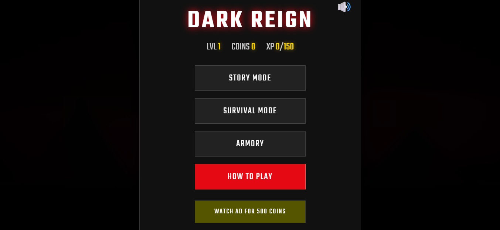
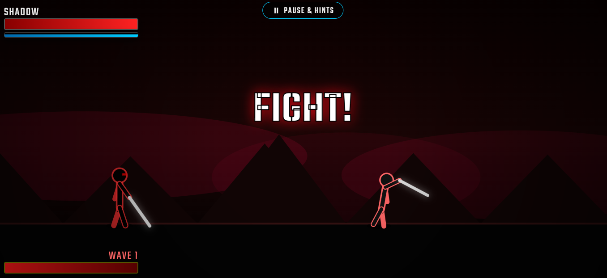
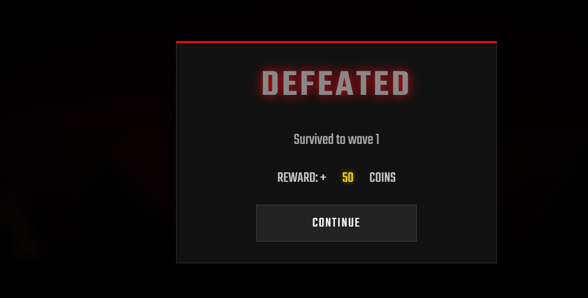

# 🥷  [**KageX**](https://github.com/radhikajayee-cmd/KageX)  

### *Master the Shadows. Rule the Arena.*

---

## 🎮 Overview

 [**KageX**](https://github.com/radhikajayee-cmd/KageX)  ** is a high-intensity ninja combat experience that blends stealth, precision fighting, and competitive multiplayer into one immersive world. Designed for players who crave fast-paced action and strategic gameplay, the game puts you in the role of a highly trained shinobi navigating a world of rival clans, hidden agendas, and relentless battles.**

Whether you prefer silent assassinations or explosive arena combat, every move you make defines your legacy.

---

## 🌌 Game Vision

> *"Not every warrior is seen. The deadliest are never heard."*

Shadow Strike: Ascension aims to deliver a next-generation ninja combat system where:

* Skill matters more than luck
* Strategy outplays brute force
* Every fight tells a story

---

## ⚔️ Core Features

### 🥷 Advanced Combat System

* Fluid, responsive melee mechanics
* Combo chains, counters, and finishers
* Weapon-based fighting styles (katanas, shurikens, dual blades)

### 🌑 Stealth & Assassination

* Dynamic stealth system with shadows and sound detection
* Silent takedowns and environmental kills
* Tactical infiltration missions

### 🌍 Multiplayer Arena (SFO Style)

* Real-time PvP battles
* Ranked matchmaking system
* Clan wars and leaderboard progression

### 🏯 Story Mode

* Deep narrative with cinematic missions
* Rival ninja clans and evolving story arcs
* Character progression and skill unlocking

### 🎨 Customization

* Unique ninja skins and outfits
* Weapon upgrades and enhancements
* Personalized combat styles

---

## 🚀 Tech Stack (Example)

* **Engine:** Unity / Unreal Engine
* **Language:** C# / C++
* **Backend:** Node.js / Firebase
* **Database:** MongoDB / Firestore
* **Multiplayer:** Photon / WebSockets

---

## 📸 Screenshots & Visuals





\

---

## 📦 Installation

```bash
# Clone the repository
git clone https://github.com/yourusername/shadow-strike-ascension.git

# Navigate to project folder
cd shadow-strike-ascension

# Install dependencies
npm install

# Run the project
npm start
```

---

## 🧠 Future Enhancements

* 🧩 AI-driven enemies
* 🌐 Open-world ninja exploration
* 🎭 Story branching choices
* 🥇 Esports tournament mode

---

## 🤝 Contributing

We welcome contributions from developers, designers, and creators!

```bash
# Fork the repo
# Create your feature branch
git checkout -b feature/AmazingFeature

# Commit your changes
git commit -m "Add some AmazingFeature"

# Push to the branch
git push origin feature/AmazingFeature
```

---

## 📜 License

This project is licensed under the **MIT License** — feel free to use, modify, and distribute.

---

## ❤️ Final Note

Shadow Strike: Ascension is more than just a game — it's a vision of immersive combat, strategy, and storytelling. Built with passion and creativity, this project aims to stand out as a unique experience in the world of ninja-based fighting games.

> *"In the shadows, legends are born."*

---

⭐ If you like this project, don’t forget to **star the repository** and support the journey!
